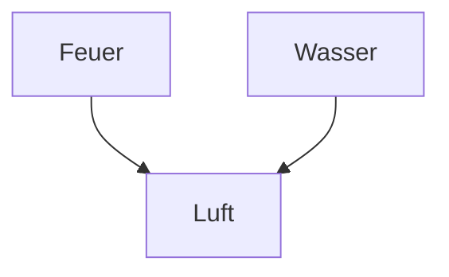

### Metadaten
client:: [[]]
location:: [[]]

## Beschreibung

[[Flam Trymbold]] ist schwer verletzt. [[Lori Horatium]] kann uns helfen ihn zu heilen. Wir müssen ihr ein paar Dinge bringen

"Aus Prima Animus ward Prima Larva"
Odium Draconis

Wir brauchen eine [[elementare Essenz]].
Lori kann umwandeln aber nicht erwecken.
Baji kann erwecken.

[[Transmutation]]
"Aus den zwei ähnlichsten Elementen kann ein Element erweckt werden."

## Brauchen

- [ ] Alchemiegegenstände
	- [ ] Mörser & Stößel
	- [ ] Atanor (Ofen)
	- [ ] Alembik
	- [ ] Retorte

Pyretikum
- [ ] Feuerkäfer

Aptasensum (Gefühl einfangen)
- [ ] traurige Melodie, gespielt am [[Mahnmal der totlosen Bande]]
- [ ] Übertragungsmedium
	- [ ] Schiefblume - wächst an geraden Wänden
	- [ ] Astbrich - wächst auf Ästen, brechen beim ernten (!)
	- [ ] Scharfkantiger Mohn - blutungsfähig (!)
	- [ ] Gramklee
- [ ] Schöner Hut für Inspiration
 

## Stand
